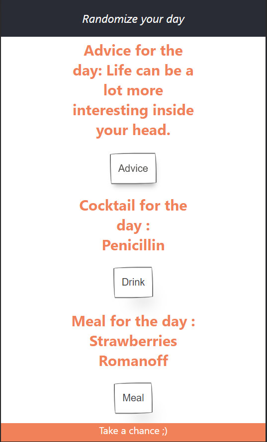

# Randomize Your Day: React-Node App

## Project Description

"Randomize Your Day" is an engaging React-Node application designed to add a delightful twist to your daily routine. This innovative app seamlessly integrates three distinct APIs to provide users with a randomized selection of a cocktail, a meal, and a piece of advice, injecting spontaneity and variety into their lives.
 

### Key Features

1. **Randomized Content:**
   - The app utilizes three separate APIs to dynamically fetch random cocktails, meals, and daily advice, ensuring a fresh and unique experience with each visit.

2. **React-Node Stack:**
   - Developed using the React-Node stack, the application delivers a responsive and interactive user interface for an enhanced user experience.

3. **Cocktail API Integration:**
   - Leveraging a cocktail API, the app offers users a randomly selected cocktail recipe, encouraging exploration of diverse flavors and mixology.

4. **Meal API Integration:**
   - The meal API integration brings a culinary dimension to the user experience, presenting a random meal recipe that inspires culinary adventures in the kitchen.

5. **Advice API Integration:**
   - A curated advice API provides users with a daily dose of wisdom, motivation, or reflection, adding a positive and insightful touch to their day.

6. **User-Friendly Design:**
   - The app boasts an intuitive and visually appealing design, ensuring seamless navigation and a delightful user interface.

7. **Customization Options:**
   - Users have the flexibility to customize their preferences, such as dietary restrictions or preferred cocktail ingredients, enhancing the personalization of their randomized selections.

8. **Social Sharing:**
   - Integration with social sharing features allows users to share their unique daily combination on social media platforms, fostering a sense of community and fun.

"Randomize Your Day" is more than just an app; it's a daily companion that introduces an element of surprise and joy into the mundane. Whether exploring new culinary delights, mixing up creative cocktails, or gaining inspiration from thoughtful advice, users are invited to embrace the unexpected and elevate their daily routines.
